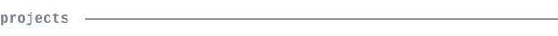

  

[x-akt](https://x-akt.com) &nbsp;·&nbsp;
[linkedin](https://www.linkedin.com/in/muhammet-yesilbas-a9401b31a/) &nbsp;·&nbsp;
[email](mailto:ali@x-akt.com)

> Informatics student at Hochschule Niederrhein. 
> Building robust data pipelines and native iOS experiences.

I build fast, automate what I can, and ship real products. Right now that's 
[X-AKT AI](#) — my digital services and IT business. Also 
deep into data management: currently working at Westnetz GmbH.

<samp>python &nbsp; swift &nbsp; sql &nbsp; c &nbsp; c++ &nbsp; databricks &nbsp; xcode &nbsp; git</samp>

**[KippQuiz](#)** &nbsp;·&nbsp; <samp>swift, xcode</samp> 
Native iOS application published on the App Store. Full lifecycle 
development from initial concept to live deployment.

